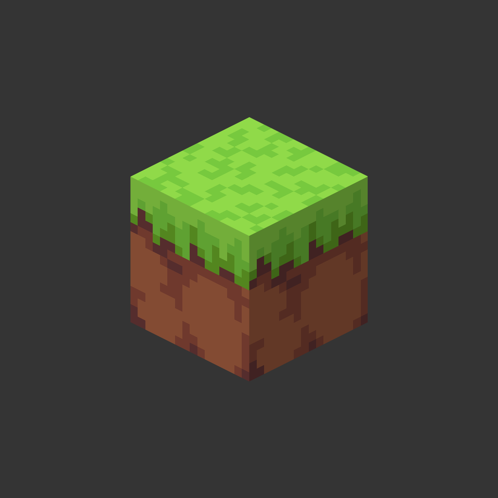

<!-- Improved compatibility of back to top link: See: https://github.com/othneildrew/Best-README-Template/pull/73 -->

<a id="readme-top"></a>

<!-- PROJECT LOGO -->
<br />
<div align="center">
  <a href="">
    
  </a>

  <h3 align="center">🌍 Pixel Quest</h3>

  <p align="center">
    The Rust based voxel-based world
  </p>
</div>

<!-- ABOUT THE PROJECT -->

## About The Project

[![Product Name Screen Shot][product-screenshot]]()

Pixel Quest is a simple 3d Voxel engine written in Rust and OpenGL, it counts with several biomes
like forests, deserts, mountains and planes

## Features

- 🌍 Infinite world functionality
- ⏩ Highly performant chunk generation
- 🌳 Different biomes available
- 📷 3d camera integrated

<p align="right">(<a href="#readme-top">back to top</a>)</p>

## Built With

- ⚙️ Rust
- 📘 Glium

<p align="right">(<a href="#readme-top">back to top</a>)</p>

<!-- GETTING STARTED -->

## Getting Started

Follow these simple steps to setup Oixel Quest locally on your machine

### Prerequisites

**Rust Nightly or Stable version**

### Steps

1. Clone the repo

   ```sh
   git clone https://github.com/DracoR22/pixelcraft.git
   ```

2. Compile and run the project

   ```sh
   cargo run
   ```

3. That's it! thats all you have to do to get Pixel Craft up and running

<p align="right">(<a href="#readme-top">back to top</a>)</p>

<!-- CONTRIBUTING -->

<!-- LICENSE -->

## License

Distributed under the MIT License. See `LICENSE.txt` for more information.

<p align="right">(<a href="#readme-top">back to top</a>)</p>

<!-- CONTACT -->

## Contact

[@your_twitter](https://twitter.com/dracor22) - rdraco039@gmail.com

My solana wallet if you want support my work - `CAThY97SjWz1nRjtVELZopz1xKRqkRkBWhXvA2BHdkdf`

Project Link: [https://github.com/DracoR22/pixelquest](https://github.com/DracoR22/pixelquest)

<p align="right">(<a href="#readme-top">back to top</a>)</p>

<!-- MARKDOWN LINKS & IMAGES -->
<!-- https://www.markdownguide.org/basic-syntax/#reference-style-links -->

[product-screenshot]:res/pixelquest/grid.png